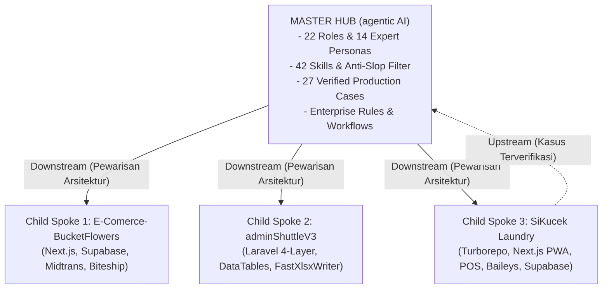

# Knowledge: Hub-and-Spoke Knowledge Sync Protocol (SiKucek Spoke)

> **Protokol Tata Kelola Hub-and-Spoke**: Dokumen ini mendefinisikan hubungan sinkronisasi pengetahuan antara repositori **Master Hub** (`agentic AI`) dan repositori implementasi **Child Spoke 3: SiKucek Laundry**.

---

## 1. Topologi Hub-and-Spoke Multi-Proyek

---

## 2. Fondasi yang Diwarisi SiKucek dari Master Hub & Spoke 1

1. **Dari Master Hub (`agentic AI`)**:
   - 4-Tier Hirarki Peran (22 Spesialis) & 14 Expert Personas DNA.
   - Core Guardrails (`00-core-guardrails.md`) & Workflow Discipline (`01-workflow-discipline.md`).
   - Anti-Slop Mandatory Delivery Gate (R-01 s.d R-38).
   - Scaffolding Stubs (Controller, Service, Repository).
2. **Dari Spoke 1 (`E-Comerce-BucketFlowers`)**:
   - Struktur Monorepo Turborepo teruji (`turbo.json`, `package.json`, pnpm workspaces).
   - Pola Konfigurasi Gateway Dinamis di Database (`PaymentGatewayConfig` -> `app_settings`).
   - Pola Resilient Mock Fallback untuk checkout offline/anti-macet saat sandbox down.
   - Pelacakan Publik Tanpa Login (`GuestTracker` di PWA).
   - Pola Result Pattern (`Result.ok()`, `Result.fail()`) dan WhatsApp Helper.

---

## 3. Protokol Upstream Sync (Penyerapan Solusi)

Jika tim menemukan bug kritis pada pengerjaan SiKucek (misal: penanganan kamera WebRTC pada berbagai model smartphone Android, kompresi WebP client-side, atau sinkronisasi WebSocket antrean Baileys) dan menyelesaikannya secara elegan:
1. Catat studi kasus ke `.agents/04-case-bank/cases/case-YYYYMMDD-sikucek-nama-kasus.yaml` dengan status `VERIFIED`.
2. Sinkronkan kasus tersebut ke `04-case-bank/cases/` Master Hub (`agentic AI`).
3. Master Hub mendaftarkan kasus tersebut ke index pusat sehingga seluruh proyek lain dapat memanfaatkan solusinya.
