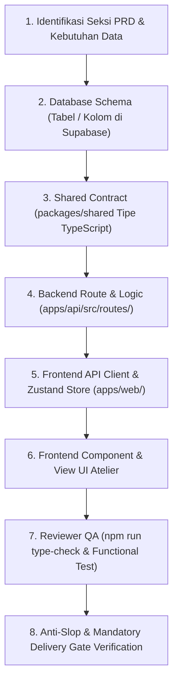

# New PRD Feature Workflow: Siklus Hidup Pembuatan Modul

Alur kerja standar untuk mengimplementasikan modul baru dari [PRD.md](../../PRD.md) ke sistem produksi:

---

---

## Rincian Tiap Tahapan:

1. **Tahap 1 - Identifikasi PRD**:
   - Baca detail seksi terkait di `PRD.md` dan pastikan acceptance criteria tercatat di `implementation_plan.md`.
2. **Tahap 2 - Database Schema**:
   - Terapkan DDL SQL pada Supabase PostgreSQL jika ada tabel baru atau modifikasi kolom.
   - Wajib menyertakan RLS (`ENABLE ROW LEVEL SECURITY`) dan policy akses.
3. **Tahap 3 - Shared Types (`packages/shared`)**:
   - Definisikan interface TypeScript di `packages/shared/src/types/` agar frontend dan backend berbagi tipe yang sama tanpa duplikasi manual.
4. **Tahap 4 - Backend Routes (`apps/api`)**:
   - Buat route Express dengan validasi input, guard clause, dan Result Pattern.
   - Sambungkan ke connection pool `pool.query()`.
5. **Tahap 5 - Frontend Store & Client (`apps/web`)**:
   - Gunakan `getApiUrl()` untuk fetch data.
   - Perbarui Zustand store terkait jika state perlu persisten atau dibagikan antar komponen.
6. **Tahap 6 - Frontend UI (`apps/web`)**:
   - Buat komponen dengan Tailwind CSS, dukungan tema A/B/C, dan Magic Motion.
   - Pastikan terdapat visual state lengkap: *Loading Skeleton*, *Empty State*, *Data State*, dan *Error Toast*.
7. **Tahap 7 - QA Verification**:
   - Jalankan `npm run type-check` (wajib 0 error di ketiga paket monorepo).
   - Lakukan smoke test HTTP endpoint.
8. **Tahap 8 - Delivery Gate**:
   - Lakukan verifikasi 4-blok Anti-Slop sebelum artefak diserahkan kepada pengguna.
