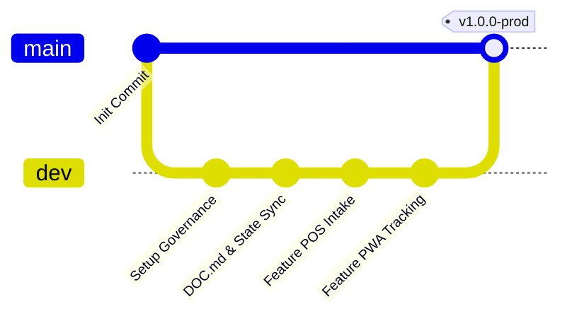
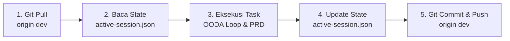

# DOC.md: Panduan Kolaborasi Tim & Pengembangan SiKucek

> **Official Team Engineering & Collaboration Guide**  
> **Dasar Rujukan Mutlak**: [`PRD.md`](./PRD.md) & [`AGENTS.md`](./AGENTS.md)  
> **Status**: Berlaku Mengikat (*Strict Mandatory*) untuk Seluruh Pengembang & Agen AI

---

## 1. Visi Produk & Topologi Monorepo

**SiKucek** adalah *Smart Hybrid Laundry Operating System* yang memadukan operasional kasir (POS), foto bukti kondisi pakaian awal (Quality Control) di Supabase Storage, pelacakan progres publik secara real-time via PWA, serta gamifikasi (Stamp Card & Daily Check-in).

Struktur repositori menggunakan arsitektur **Turborepo & pnpm workspaces**:

```
SiKucek/
├── apps/
│   ├── web/                    # Portal Pelanggan PWA & Public Tracking (Next.js 15 App Router)
│   ├── pos/                    # Kasir & Operator Laundry Portal (Next.js / Vite SPA + WebRTC Camera)
│   └── worker/                 # WhatsApp Automation Engine (Node.js + Baileys Library)
├── packages/
│   ├── shared/                 # Zod Schemas, TypeScript DTOs, Enums, & Formatters Bersama
│   ├── ui/                     # Design System Komponen (Tailwind, Radix/Shadcn, Maskot UI)
│   └── database/               # Skrip Migrasi SQL Supabase, RLS Policies, & Seeders
├── .agents/                    # Tata Kelola Multi-Agen, SOP, Rules, & Session State Tracker
│   ├── 01-roles/               # 22 Spesialis & 14 Expert Personas DNA
│   ├── 02-session-state/       # active-session.json & session-manager.js
│   ├── 04-case-bank/           # Basis Pengetahuan Kasus Terverifikasi
│   ├── knowledge/              # Peta PRD & Sinkronisasi Hub-and-Spoke
│   ├── rules/                  # Standar Rekayasa (00-core s.d 50-excel)
│   └── workflows/              # SOP Eksekusi Fitur, Migrasi DB, & QA Gate
├── AGENTS.md                   # Universal Multi-Agent Governance Entry File
├── PRD.md                      # Spesifikasi Kebutuhan Produk (13 Bab)
├── DOC.md                      # Panduan Pengembangan & Kolaborasi Tim (File Ini)
├── README.md                   # Dokumentasi Ringkas Repositori
└── LICENSE                     # Lisensi MIT (Ahmad Arif & SiKucek Contributors)
```

### Larangan Keras Halusinasi Direktori (*Monorepo Path Guard*):
- Dilarang membuat folder baru di root (seperti `src/`, `backend/`, atau `frontend/`).
- Kode portal pelanggan **WAJIB** berada di `apps/web/src/`.
- Kode aplikasi kasir/operator **WAJIB** berada di `apps/pos/src/`.
- Kode bot WhatsApp **WAJIB** berada di `apps/worker/src/`.
- Kode kontrak tipe & Zod **WAJIB** berada di `packages/shared/src/`.

---

## 2. Git Branching Strategy & Kebijakan Kolaborasi Tim

Untuk mencegah konflik kode dan menjaga stabilitas lingkungan produksi, tim menerapkan pemisahan dua cabang utama:



1. **Branch `dev` (Active Development - DEFAULT)**:
   - Seluruh pekerjaan penambahan fitur, perbaikan bug, penyesuaian desain, dan eksperimen harian **WAJIB** dilakukan di branch `dev`.
   - Seluruh pengembang dan agen AI wajib berada di branch ini selama fase pengembangan aktif.
2. **Branch `main` (Production Release - PROTECTED)**:
   - Branch `main` diproteksi ketat dan hanya menerima penggabungan (*merge*) dari `dev` saat seluruh fitur sprint telah stabil, teruji, dan lulus verifikasi QA Delivery Gate.
   - Dilarang melakukan *direct commit* atau *force push* ke branch `main`.

---

## 3. Protokol Sinkronisasi Session State Multi-Agen (`active-session.json`)

Agar seluruh anggota tim dan agen AI pada perangkat/sesi yang berbeda dapat membaca konteks pengerjaan sebelumnya tanpa mengalami amnesia (*context drift*), tim menerapkan **SOP Wajib 5 Langkah pada Setiap Siklus Perubahan Prompt/Fitur**:



### Rincian SOP 5 Langkah:

1. **Langkah 1 - Tarik Pembaruan Terbaru (*Sync Pull*)**:
   Sebelum memulai prompt atau tugas baru, selalu jalankan:
   ```bash
   git pull --rebase origin dev
   ```
2. **Langkah 2 - Inspeksi Sesi Aktif (*Read State*)**:
   Periksa status milestone dan batasan yang sedang berjalan menggunakan CLI:
   ```bash
   node .agents/02-session-state/session-manager.js
   ```
   Agen akan membaca file `.agents/02-session-state/active-session.json` untuk mengetahui sub-tugas yang sedang aktif, milestone yang sudah selesai, serta batasan yang terkunci.
3. **Langkah 3 - Eksekusi Tugas Sesuai Bab PRD**:
   Kembangkan kode dengan mematuhi bab terkait pada [`PRD.md`](./PRD.md) dan aturan pada `.agents/rules/`.
4. **Langkah 4 - Mutakhirkan `active-session.json`**:
   Setelah fitur atau sub-tugas selesai diverifikasi:
   - Perbarui field `last_updated`.
   - Pindahkan milestone yang telah selesai ke dalam array `completed_milestones` dengan status `VERIFIED_PASS`.
   - Perbarui status bab pada `prd_coverage_tracker` (misal dari `IN_PROGRESS` menjadi `MAPPED` atau `COMPLETED`).
5. **Langkah 5 - Tarik Ulang Sebelum Push & Kirim ke GitHub (*Sync Push Mandate*)**:
   Tepat sebelum melakukan `git push`, jalankan kembali `git pull --rebase origin dev` untuk memastikan tidak ada perubahan tim lain yang masuk selama development, lalu lakukan push:
   ```bash
   git add .
   git commit -m "feat(modul): deskripsi perubahan fitur dan update session state"
   git pull --rebase origin dev
   git push origin dev
   ```
   Dengan demikian, rekan tim atau agen di perangkat lain yang menjalankan `git pull` akan langsung mengetahui status terkini proyek tanpa risiko konflik (zero merge conflict).

---

## 4. Enam Aturan Bisnis Mutlak (*The 6 Golden Rules of SiKucek*)

Seluruh pengembang dan agen AI wajib mematuhi 6 aturan baku ini tanpa kompromi:

1. **Prinsip Zero-Hardcode (Bab 13 PRD)**:
   - Dilarang keras menaruh kunci API Midtrans, template pesan WhatsApp, atau aturan minimal kg di dalam kodingan. Seluruhnya wajib dibaca dari tabel `public.app_settings` di Supabase.
   - Kolom dengan `is_secret = TRUE` wajib diisolasi hanya untuk Service Role dan backend.
2. **Logika Diskon Parsial Kupon Stempel (Bab 10.4 PRD)**:
   - Kupon hadiah stempel "Gratis Cuci Kiloan Maksimal 5 Kg" **HANYA MEMOTONG PORSI TAGIHAN KILOAN**.
   - Porsi cucian satuan (kemeja, jas, bed cover) tetap ditagihkan penuh tanpa potongan.
3. **Guardrail Wajib Nomor Rak Fisik (Bab 10.5 PRD)**:
   - Operator kasir **DILARANG MENGUBAH STATUS PESANAN MENJADI READY** sebelum kolom `rack_location` terisi valid.
4. **Resilient Mock Fallback untuk Midtrans**:
   - Jika koneksi internet outlet offline atau Midtrans Sandbox mengalami gangguan, sistem kasir otomatis menyediakan simulation token agar penerimaan cucian pelanggan tidak pernah macet (*anti-freeze*).
5. **Reviewer Independence (No Self-Review)**:
   - Pembuat kode (*Builder*) dilarang mereview kodenya sendiri. Setiap artefak wajib melalui verifikasi independen oleh *Reviewer* (`qa-engineer` atau `tech-critic`).
6. **Bebas Em Dash (R-02 Anti-Slop)**:
   - Larangan mutlak penggunaan karakter em dash panjang (`—`). Gunakan tanda minus biasa (`-`) atau titik dua.

---

## 5. Peta Navigasi Cepat 13 Bab PRD ([PRD.md](./PRD.md))

| Bab PRD | Modul & Fitur | Tabel Terkait di Supabase | Lokasi Kode Utama |
| :--- | :--- | :--- | :--- |
| **Bab 1** | Ringkasan Eksekutif & Zero-Cost Infrastructure | `profiles`, `orders` | Workspace Config |
| **Bab 2** | Identitas Brand & Integrasi Maskot | Aset: `logo-sikucek.jpg`, `text-sikucek.jpg` | `packages/ui`, `apps/web/src` |
| **Bab 3** | Arsitektur Monorepo Turborepo | Workspaces: `apps/*`, `packages/*` | `package.json`, `turbo.json` |
| **Bab 4** | User Personas & Alur Perjalanan Pengguna | `profiles (customer, cashier)` | `apps/web`, `apps/pos` |
| **Bab 5** | Matriks Fitur Lengkap (MoSCoW P0, P1, P2) | Seluruh Tabel Inti | End-to-End Apps |
| **Bab 6** | Desain UI/UX & Motion Personality | Token Tailwind, Micro-animations | `packages/ui`, `apps/web/src/app` |
| **Bab 7** | Skema Database Supabase & DDL SQL | 18 Tabel PostgreSQL | `packages/database` |
| **Bab 8** | Roadmap Implementasi 5 Sprint | Sprint Planning & Deliverables | Project Management |
| **Bab 9** | Kriteria Sukses (QA Delivery Gate) | Anti-Slop R-01 s.d R-38 | `.agents/workflows/` |
| **Bab 10.1**| POS Order Intake Hybrid (Kiloan + Satuan) | `orders`, `order_items`, `services` | `apps/pos/src/app/orders/new` |
| **Bab 10.2**| Modul QC Foto Cacat Awal (WebRTC) | `order_qc_photos`, Bucket `qc-photos` | `apps/pos/src/components/qc` |
| **Bab 10.3**| Public Tracking PWA Tanpa Login | `orders`, `order_status_logs` | `apps/web/src/app/track/[code]`|
| **Bab 10.4**| Gamifikasi: Stamp Card & Daily Check-in | `loyalty_stamp_cards`, `daily_checkins` | `apps/web/src/app/app` |
| **Bab 10.5**| Manajemen Rak Fisik (Rack Locator) | `racks`, `orders.rack_location` | `apps/pos/src/components/orders`|
| **Bab 10.6**| WhatsApp Automation Engine (Baileys) | `whatsapp_queue` | `apps/worker/src` |
| **Bab 11** | Peta Situs (Sitemap & Rute Lengkap) | Next.js App Router Structure | `apps/web/src/app`, `apps/pos/src/app` |
| **Bab 12** | Mesin Pemasaran, Diskon ROI, & Referral | `marketing_campaigns`, `referral_logs` | `apps/pos/src/app/admin/marketing` |
| **Bab 13** | Arsitektur Zero-Hardcode & Config Vault | `app_settings` (Kunci Midtrans, Rules) | `apps/pos/src/app/admin/settings` |

---

## 6. Perintah Kerja CLI Penting

Berikut adalah perintah praktis yang sering digunakan selama pengembangan:

```bash
# 1. Memeriksa status sesi & tracking PRD
node .agents/02-session-state/session-manager.js

# 2. Menjalankan seluruh aplikasi secara paralel (Web, POS, Worker)
pnpm dev

# 3. Menjalankan aplikasi tertentu saja
pnpm --filter web dev        # Menjalankan PWA Pelanggan (Port 3000)
pnpm --filter pos dev        # Menjalankan POS Kasir (Port 3001)
pnpm --filter worker dev     # Menjalankan Worker WhatsApp

# 4. Validasi tipe TypeScript di seluruh workspace
pnpm type-check

# 5. Mematikan port zombie jika server tertinggal di background
pnpm kill:port

# 6. Membangun bundle produksi
pnpm build
```

---

## 7. Kriteria Selesai (*Definition of Done - DoD*)

Sebelum sebuah tugas/fitur dianggap selesai dan siap digabung:
1. Kode telah diuji secara fungsional (bebas error kompilasi dan tipe data).
2. Mematuhi batasan folder monorepo (`apps/web`, `apps/pos`, `packages/shared`).
3. Bebas dari hardcode kredensial dan bebas karakter em dash.
4. File `.agents/02-session-state/active-session.json` telah dimutakhirkan.
5. Perubahan telah dikomit dan di-push ke branch `dev`.
